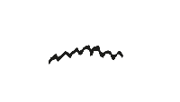

# Behringer Pro VS Mini

Clone miniature du synthétiseur emblématique de chez Sequential : le Prophet VS.

# Repérage des réglages

# Comment mettre au point un PRESET

Cette documentation se focalise exclusivement sur les aspects du paramétrage d'un PRESET, et rien d'autre.

Cette documentation n'explique pas les concepts habituels qu'on retrouve sur tout synthétiseur. Par exemple, elle n'explique pas comment fonctionne un filtre passe bas, ce qu'est une enveloppe, un VCA ou un VCF, comment fonctionne un LFO ni comment il se paramètre, encore moins comment fonctionne le séquenceur ou l'arpégiateur.

## A. Fonctionnement de la synthèse vectorielle

Contrairement à la synthèse sonore conventionnelle pour laquelle les sons de plusieurs oscillateurs sont mélangés afin de produire un son basique, la synthèse vectorielle consiste à modifier continuellement la balance entre le son de 4 oscillateurs (A, B, C, et D) en utilisant le joystick [8] et l’enveloppe de mixage. Le timbre du son peut ainsi être modifié de manière subtile ou drastique lors de votre performance en fonction de la forme d’onde sélectionnée pour chaque oscillateur et de l’intensité de l’automation de mixage que vous utilisez. 

Lorsque le joystick [8] est en position centrale, les oscillateurs ont tous le même niveau dans le mix. Si vous déplacez le joystick [8] vers le haut, le niveau de l’oscillateur B augmente et le niveau de l’oscillateur D diminue ; les oscillateurs A et C conservent le même niveau. Si vous le bougez vers la gauche, le niveau de l’oscillateur A augmente, le niveau de C diminue et B et D ne sont pas affectés. De plus, si vous placez par exemple le joystick [8] au maximum entre A et B (nord ouest), ces deux oscillateurs auront le niveau maximum alors que C et D seront au minimum. Si vous le déplacez en direction sud est, le niveau de A et B diminue et le niveau de C et D augmente proportionnellement, jusqu’à ce que A et B ne se fassent plus entendre du tout.

Vous obtenez ainsi un son qui se transforme sur un plan en 2 dimensions avec le mouvement du joystick, à quoi s’ajoute l’automation de l’enveloppe de mixage véctoriel.

## B. La touche `Mix` donne accès aux paramètres

Un appui sur la touche `Func` [28], puis sur la touche du clavier `Mix` [43], donne accès au paramétrage de l’enveloppe de mixage vectoriel. Naviguez à travers les menus  en appuyant  sur la touche du clavier `Mix` [43] : chaque appui permet de passer au menu suivant.

### 1. Le menu `MIX ENV LOOL` définit les points de la boucle

Ce paramètre permet de **définir une section de l’enveloppe de mixage vectoriel qui va boucler**, c’est-à-dire répéter certains des 5 points entre 0 et 4.

En appyant sur les touches `+` [9] et `-` [10] vous pouvez faire défiler les options suivantes :

| Valeur  | Signification technique                                            |
| ------- | ------------------------------------------------------------------ |
| `off`   | Aucun point ne boucle. L’enveloppe se joue une seule fois.         |
| `0->3`  | Les points 0 à 3 sont joués en boucle (puis retour à 0).           |
| `1->3`  | Les points 1 à 3 sont bouclés. Le point 0 est joué une seule fois. |
| `2->3`  | Seuls les points 2 à 3 sont bouclés.                               |
| `0<->3` | Les points 0 à 3 sont bouclés **en aller-retour** (ping-pong).     |
| `1<->3` | Idem, mais en ping-pong de 1 à 3.                                  |
| `2<->3` | Idem, ping-pong de 2 à 3.                                          |

> **Utilité musicale** : Cela permet par exemple d’avoir un morphing continu entre deux ou trois positions vectorielles pendant qu'une note est tenue (pad, drone, etc.).

### 2. Le menu `MIX ENV REPEAT` définit le nombre de répétitions

Ce paramètre contrôle **combien de fois la boucle définie ci-dessus se répète**.

En appyant sur les touches `+` [9] et `-` [10] vous pouvez faire défiler les options suivantes :

- **1 à 7** : La boucle est répétée 1 à 7 fois.

- **Continuous** : La boucle tourne **indéfiniment** tant que la note est tenue.

> **Utilité** : Cela évite que le morphing tourne en boucle éternellement si vous souhaitez un mouvement évolutif mais limité (par exemple : faire 5 fois `0<->3` et s’arrêter).

L'illustration suivante peut aider à se figurer ce qu'il se passe dans le temps avec une enveloppe filtre, ou une enveloppe amplification.

### 3. Les menus `MIX ENV POINT: 0` à `4` définissent les positions vectorielles dans le temps

Ce sont **les 5 points (les 4 segments)** de l’enveloppe vectorielle (comme une enveloppe multi-étapes).

À l'aide des touches `+` [9] et `-` [10] vous pouvez faire défiler les paramètres de chacun des 5 points (étapes).

Chaque point 0, 1, 2, 3 et 4 représente une étape dans le temps : une position des 4 oscillateurs A, B, C et D dans l’espace X/Y du mixage vectoriel.

Par exemple à l'étape 0, les oscillateurs A, B, C et D seront réparties d'une façon, puis à l'étape 1, d'une autre, etc.

L'état des 4 oscillateurs (A, B, C, ou D), c'est à dire la dominance de chacun d'eux à une étape donnée, peut-être réglé à l'aide du joystick [8]. Cet état peut avoir une valeur située entre 0 et 99 ; déterminant à quel point chacun d'eux domine à cette étape.

Par exemple, les valeurs `a25 b25 c25 d25` montrent une étape qui présente un équilibre entre les 4 oscillateurs A, B, C et D. Les valeurs `a00 b99 c00 d00` montrent une étape où seul l'oscillateur B domine. Etc.

Ainsi, à l'aide du **joystick** [8], il est possible de **doser la dominance** de chaque oscillateur à chaque étape.

> **Utilité :** cela vous permet de définir une **trajectoire dans le plan vectoriel** que suivra le son au fil du temps.

## C. Comprendre la troisième enveloppe : `MIX`

Sur le Pro VS Mini, vous avez **trois enveloppes indépendantes**, accessibles via le bouton ENVELOPE [11] :

| LED allumée | Enveloppe contrôlée       | Affectation                                                                  |
| ----------- | ------------------------- | ---------------------------------------------------------------------------- |
| **FIL**     | Enveloppe du filtre       | Contrôle du cutoff                                                           |
| **AMP**     | Enveloppe VCA             | Contrôle du volume                                                           |
| **MIX**     | **Enveloppe vectorielle** | Contrôle du temps mis entre chacun des 5 points 0 à 4 (ou de chaque segment) |

### À quoi correspondent les valeurs `R1` à `R4` quand la LED `MIX` est allumée ?

Ce sont les **4 segments de temps** qui déterminent **combien de temps le son met à passer** d’un point à l’autre :

| Potentiomètre | Transition concernée                   |
| ------------- | -------------------------------------- |
| **R1**        | Durée de la transition **Point 0 → 1** |
| **R2**        | Durée de **Point 1 → 2**               |
| **R3**        | Durée de **Point 2 → 3**               |
| **R4**        | Durée de **Point 3 → 4**               |

Ces durées sont exprimées en valeurs de 0 à 99. Plus la valeur est élevée, plus la transition entre les deux points est lente (la progression dure plus longtemps).

Notons que le passage d'un état à un autre est progressif ; un effet de morphing s'opère pour parvenir à l'état suivant.

## D. Les formes d'onde

Le Pro VS Mini dispose de 128 formes d'onde, que l'on peut régler pour chacun des  4 oscillateurs A, B, C et D. 

La sélection de l'oscillateur se fait par le bouton `OSC` [21]. À chaque pression la sélection de l'oscillateur suivant s'effectue et est repérée par une led.

Le potentiomètre `WAVE` [22] permettent de changer la forme d'onde ; son numéro est indiqué sur l'afficheur et correspond à celui de la liste détaillée ci-dessous. Enfin, si nécessaire, le potentiomètre `FREQ` [23] peut faire varier la fréquence, le niveau est lui aussi indiqué sur l'afficheur.

Notons qu'il est possible rendre un oscillateur **silencieux** à l'aide du numéro 126, qu'il est permis d'exploiter un **bruit blanc** à l'aide du numéro 127 et que les numéros pour les formes de base sont 32 ou  96 pour une **onde sinusoïdale**, 33 pour une **onde en dents de scie** et 34, ou 50 pour un **signal carré**.

Voici la liste exhaustive des formes d'onde disponibles sur le Behringer Pro VS Mini :

| Numéro | Nom                  | Forme                                         |
| ------ | -------------------- | --------------------------------------------- |
| 0      | Twang                |  |
| 1      | Clav                 |  |
| 2      | Xylophone            |  |
| 3      | Slippery Slope       |  |
| 4      | Enharmonic Square    |  |
| 5      | Xylophone 2          |  |
| 6      | Mellow Square        |  |
| 7      | Chaos 1              |  |
| 8      | Chaos 2              |  |
| 9      | Chaos 3              |  |
| 10     | Chaos 4              |  |
| 11     | Bright Square        |  |
| 12     | Hollow               |  |
| 13     | BP Square            |  |
| 14     | Ski Slope 1          |  |
| 15     | Rasp                 |  |
| 16     | Peal                 |  |
| 17     | Fuzz                 |  |
| 18     | Floss                |  |
| 19     | Excite               |  |
| 20     | Awaken               |  |
| 21     | Energize             |  |
| 22     | BP Twang             |  |
| 23     | Complex Pulse        |  |
| 24     | Mellow Square 2      |  |
| 25     | Harmonic Square      |  |
| 26     | Thin Ramp            |  |
| 27     | Xylophone 3          |  |
| 28     | Thin Square          |  |
| 29     | Harmonic Ramp        |  |
| 30     | Rouse                |  |
| 31     | Waken                |  |
| 32     | Sine                 |  |
| 33     | Sawtooth             |  |
| 34     | Square               |  |
| 35     | Dome 1               |  |
| 36     | Dome 2               |  |
| 37     | Mellow Dome          |  |
| 38     | Dome 3               |  |
| 39     | Dome 4               |  |
| 40     | Rasp 1               |  |
| 41     | Rasp 2               |  |
| 42     | Rasp 3               |  |
| 43     | Rasp 4               |  |
| 44     | Dome 5               |  |
| 45     | HP Saw               |  |
| 46     | High BP Saw          |  |
| 47     | High BP Square       |  |
| 48     | Vocal                |  |
| 49     | Squeeze box          |  |
| 50     | Pulse                |  |
| 51     | Limp Saw             |  |
| 52     | Spark Wave 1         |  |
| 53     | Spark Wave 2         |  |
| 54     | Spark Wave 3         |  |
| 55     | Mid Wave 1           |  |
| 56     | Cacophnous Buzz 1    |  |
| 57     | Mid Buzz 1           |  |
| 58     | Dome 6               |  |
| 59     | Soft Dome 3          |  |
| 60     | Dome 7               |  |
| 61     | Spark Wave 4         |  |
| 62     | Spark Wave 5         |  |
| 63     | Soft Dome 4          |  |
| 64     | Dome 8               |  |
| 65     | Organ                |  |
| 66     | Spark Wave 5         |  |
| 67     | Soft Wave 1          |  |
| 68     | Soft Wave 2          |  |
| 69     | Spark Wave 7         |  |
| 70     | Reed                 |  |
| 71     | Soft Wave 3          |  |
| 72     | Soft Wave 4          |  |
| 73     | Saxophone            |  |
| 74     | Soft Wave 5          |  |
| 75     | Trashy Wave 1        |  |
| 76     | Trashy Wave 2        |  |
| 77     | Trashy Wave 3        |  |
| 78     | Trashy Wave 4        |  |
| 79     | Trashy Wave 5        |  |
| 80     | Trashy Wave 6        |  |
| 81     | Jaw Harp 1           |  |
| 82     | Jaw Harp 2           |  |
| 83     | Soft Wave 6          |  |
| 84     | Thin 1               |  |
| 85     | Thin 2               |  |
| 86     | Spark Wave 8         |  |
| 87     | Spark Wave 9         |  |
| 88     | Spark Wave 10        |  |
| 89     | Soft Dome 5          |  |
| 90     | Soft Dome 6          |  |
| 91     | Cacophonous Buzz 2   |  |
| 92     | Thin 3               |  |
| 93     | Spark Wave 11        |  |
| 94     | Soft Dome 7          |  |
| 95     | Soft Wave 7          |  |
| 96     | Sine 2               |  |
| 97     | Sync’d Sine          |  |
| 98     | Trashy Wave 7        |  |
| 99     | Twingle Pad          |  |
| 100    | Dome 9               |  |
| 101    | Thin 4               |  |
| 102    | Thin 5               |  |
| 103    | Trashy Wave 8        |  |
| 104    | Trashy Wave 9        |  |
| 105    | Trashy Wave 10       |  |
| 106    | Trashy Wave 11       |  |
| 107    | Trashy Wave 12       |  |
| 108    | Trashy Wave 13       |  |
| 109    | Spark Wave 12        |  |
| 110    | Spark Wave 13        |  |
| 111    | Trashy Wave 14       |  |
| 112    | Trashy Wave 15       |  |
| 113    | Rainbow              |  |
| 114    | Soft Dome 8          |  |
| 115    | Trashy Wave 15       |  |
| 116    | Soothing 1           |  |
| 117    | Soothing 2           |  |
| 118    | Space Wave           |  |
| 119    | 5th Rasp             |  |
| 120    | Octave Wave          |  |
| 121    | Triangle + Overtones |  |
| 122    | Pulse + Overtones    |  |
| 123    | Rising Square        |  |
| 124    | Soft Wave 8          |  |
| 125    | Cacophonous Buzz 3   |  |
| 126    | Silence              |  |
| 127    | White Noise          |  |

## E. Finaliser le PRESET

Les fonctions `PROGRAM` sur le clavier, disponibles par la pression de la touche `FUNC` [28] permettent de finaliser votre œuvre : c'est à dire de lui donner un nom (de l'éditer) avec la touche `NAME` [44] (chaque touche du clavier porte une lettre alphabétique de A à Z avec un espace sur la dernière) et de la stocker en mémoire grâce à la touche `STORE` [46].

La fonction `INIT` [45] quand à elle permet de remettre tous les réglages de votre PRESET à zéro. Si vous l'avez employé par inadvertance, il suffit d'éteindre et de rallumer votre Pro VS Mini pour récupérer vos paramètres originaux, si bien sûr il avaient été stockés préalablement. À employer avec prudence.
