# Behringer Pro VS Mini

## Formes d’ondes

Voici la liste exhaustive des formes d'onde disponibles sur le Behringer Pro VS Mini

| ID  | Nom                                                  | Description                                                       | Forme                                         |
| --- | ---------------------------------------------------- | ----------------------------------------------------------------- | --------------------------------------------- |
| 000 | Twang (Twang)                                     | Claquant, style guitare — lead punchy, percussions synth          |  |
| 001 | Clav (Clav)                                       | Timbre percussif de type clavinet, sons funk/électro              |  |
| 002 | Xylophone (Xylophone)                             | Timbre percussif ressemblant à un xylophone, sons mallets         |  |
| 003 | Slippery Slope (Pente glissante)                  | Texture évolutive, idéale pour effets de transition               |  |
| 004 | Enharmonic Square (Carrée enharmonique)           | Onde carrée modifiée, textures argentées ou métalliques           |  |
| 005 | Xylophone 2 (Xylophone 2)                         | Variante alternative du xylophone, plus brillante ou sombre       | 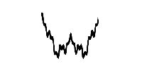 |
| 006 | Mellow Square (Carrée feutrée)                    | Onde carrée douce, adaptée aux basses rondes vintage              |  |
| 007 | Chaos 1 (Chaos 1)                                 | Texture imprévisible, idéale pour glitch ou atmosphères instables |  |
| 008 | Chaos 2 (Chaos 2)                                 | Variante de Chaos 1, effets similaires                            |  |
| 009 | Chaos 3 (Chaos 3)                                 | Idem Chaos 2, avec variation de spectre                           | 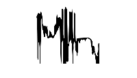 |
| 010 | Chaos 4 (Chaos 4)                                 | Encore une autre version, toujours pour effets aléatoires         | 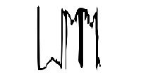 |
| 011 | Bright Square (Carrée brillante)                  | Carrée avec plus d’aigus, idéale pour leads brillants             | 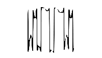 |
| 012 | Hollow (Creuse)                                   | Onde creusée au centre du spectre, sensation de vide spectral     |  |
| 013 | BP Square (Carrée passe-bande)                    | Carrée filtrée, stéréoscopie naturelle, son éthéré                | 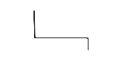 |
| 014 | Ski Slope 1 (Pente ski 1)                         | Rampe douce, utile pour sons ambient ou balayages                 |  |
| 015 | Rasp (Râpe)                                       | Son râpeux, bon pour percussions synthétiques                     | 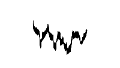 |
| 016 | Peal (Cloche)                                     | Timbre métallique, bell-like, parfait pour percussions claires    |  |
| 017 | Fuzz (Flou)                                       | Son saturé, utile pour leads distordus ou textures rugueuses      |  |
| 018 | Floss (Soie)                                      | Texture douce et filée, pour nappes veloutées                     |  |
| 019 | Excite (Excitation)                               | Forme nerveuse et rapide, bon pour rythmes dynamiques             |  |
| 020 | Awaken (Éveil)                                    | Montée progressive, génère tension et anticipation                | 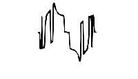 |
| 021 | Energize (Dynamisation)                           | Onde agressive et brillante, leads vifs                           | 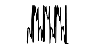 |
| 022 | BP Twang (Twang passe-bande)                      | Twang filtré, bon pour sons funky doux                            | 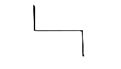 |
| 023 | Complex Pulse (Impulsion complexe)                | Onde pulsée avec modulation interne, rythmes sophistiqués         | 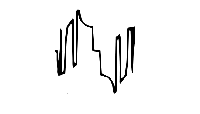 |
| 024 | Mellow Square 2 (Carrée feutrée 2)                | Variante douce, pour pads épais et chauds                         |  |
| 025 | Harmonic Square (Carrée harmonique)               | Carrée enrichie en harmoniques, texture complexe                  |  |
| 026 | Thin Ramp (Rampe mince)                           | Rampe à spectre fin, utilisée pour sons subtils                   | 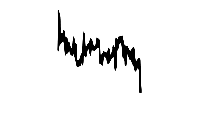 |
| 027 | Xylophone 3 (Xylophone 3)                         | Timbre percussif sec, type bois ou métal fin                      | 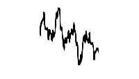 |
| 028 | Thin Square (Carrée mince)                        | Carrée à spectre réduit, pour timbres modérés                     | 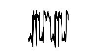 |
| 029 | Harmonic Ramp (Rampe harmonique)                  | Rampe enrichie pour nappes et textures vibrantes                  |  |
| 030 | Rouse (Éveil 2)                                   | Transition douce, montée progressive sonore                       | 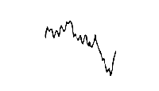 |
| 031 | Waken (Réveil)                                    | Équivalent alternatif de Awaken                                   |  |
| 032 | Sine (Sinusoïdale)                                | Onde pure, idéale pour basses profondes ou modulateur FM          | 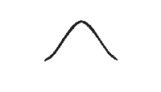 |
| 033 | Sawtooth (Dent de scie)                           | Riche en harmoniques, parfaite pour basses, leads                 |  |
| 034 | Square (Carrée)                                   | Onde pleine en harmoniques impaires, pour sons vintage            |  |
| 035 | Dome 1 (Dôme 1)                                   | Onde arrondie, chaleureuse pour pads                              |  |
| 036 | Dome 2 (Dôme 2)                                   | Variante douce pour ambiances feutrées                            |  |
| 037 | Mellow Dome (Dôme doux)                           | Encore plus feutré, idéal pour ambient, petit orgue humble teinté |  |
| 038 | Dome 3 (Dôme 3)                                   | Pad équilibré, légèrement vibrant                                 | 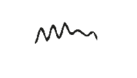 |
| 039 | Dome 4 (Dôme 4)                                   | Timbre organique arrondi                                          |  |
| 040 | Rasp 1 (Râpe 1)                                   | Son râpeux, pour textures percussives et agressives               |  |
| 041 | Rasp 2 (Râpe 2)                                   | Variante avec rugosité différente, effets texturés                |  |
| 042 | Rasp 3 (Râpe 3)                                   | Texture dense et sèche                                            | 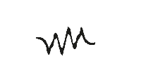 |
| 043 | Rasp 4 (Râpe 4)                                   | Version plus profonde ou plus brillante selon filtrage            |  |
| 044 | Dome 5 (Dôme 5)                                   | Onde ronde, douce et enveloppante                                 |  |
| 045 | HP Saw (Dent de scie passe-haut)                  | Dent de scie filtrée, plus claire et moins dense                  |  |
| 046 | High BP Saw (Dent de scie passe-bande haute)      | Pour textures focalisées et aiguisées                             |  |
| 047 | High BP Square (Carrée passe-bande haute)         | Carrée filtrée brillamment, utile pour arpèges nets               | 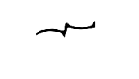 |
| 048 | Vocal (Vocal)                                     | Onde à formant vocal, idéale pour sons chantants ou expressifs    | 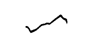 |
| 049 | Squeeze box (Squeeze box)                         | Imite l&#039;accordéon, sons organiques et compressés             |  |
| 050 | Pulse (Impulsion)                                 | Pulse simple, utile pour rythmes ou modulation PWM                |  |
| 051 | Limp Saw (Dent de scie molle)                     | Dent de scie atténuée, plus douce pour pads et leads tranquilles  |  |
| 052 | Spark Wave 1 (Vague étincelle 1)                  | Percussive, granuleuse, bonne pour effets glitch                  | 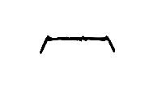 |
| 053 | Spark Wave 2 (Vague étincelle 2)                  | Variante texturée et plus aérée                                   | 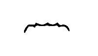 |
| 054 | Spark Wave 3 (Vague étincelle 3)                  | Plus brillante et énergétique                                     | 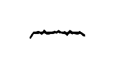 |
| 055 | Mid Wave 1 (Vague moyenne 1)                      | Onde médiane équilibrée, utile pour nappes ou timbres neutres     | 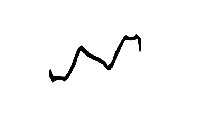 |
| 056 | Cacophnous Buzz 1 (Bourdonnement cacophonique 1)  | Son saturé, dense et chaotique, FX ou basses dures                | 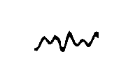 |
| 057 | Mid Buzz 1 (Bourdonnement moyen 1)                | Buzz plus contenu, utilisable sur leads rétro ou FM               |  |
| 058 | Dome 6 (Dôme 6)                                   | Onde arrondie, texture subtile pour pads évolutifs                |  |
| 059 | Soft Dome 3 (Dôme doux 3)                         | Encore plus doux, parfait pour ambient                            |  |
| 060 | Dome 7 (Dôme 7)                                   | Timbre chaud, enveloppant                                         | 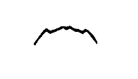 |
| 061 | Spark Wave 4 (Vague étincelle 4)                  | Texture sèche, granuleuse                                         |  |
| 062 | Spark Wave 5 (Vague étincelle 5)                  | Utilisable sur sons percussifs                                    |  |
| 063 | Soft Dome 4 (Dôme doux 4)                         | Pad doux, idéal en superposition                                  | 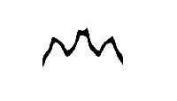 |
| 064 | Dome 8 (Dôme 8)                                   | Onde douce et large, très enveloppante                            | 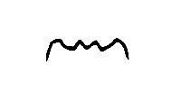 |
| 065 | Organ (Orgue)                                     | Imitation d’orgue électronique, utile pour sons rétro             |  |
| 066 | Spark Wave 5 (Vague étincelle 5)                  | Impulsive, utile pour percussions synthétiques                    |  |
| 067 | Soft Wave 1 (Vague douce 1)                       | Onde fluide, idéale pour nappes calmes, clavecin                  |  |
| 068 | Soft Wave 2 (Vague douce 2)                       | Variante douce, ambient, clavecin                                 | 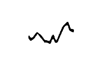 |
| 069 | Spark Wave 7 (Vague étincelle 7)                  | Plus énergétique, texture vive                                    |  |
| 070 | Reed (Anche)                                      | Imite les instruments à anche, sax-like ou hautbois               | 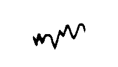 |
| 071 | Soft Wave 3 (Vague douce 3)                       | Timbre léger et flou                                              |  |
| 072 | Soft Wave 4 (Vague douce 4)                       | Encore plus douce pour pads de fond                               |  |
| 073 | Saxophone (Saxophone)                             | Imitation de sax, utile pour solo synthétique                     |  |
| 074 | Soft Wave 5 (Vague douce 5)                       | Idéal pour textures soyeuses                                      | 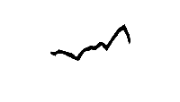 |
| 075 | Trashy Wave 1 (Vague sale 1)                      | Rugueuse et saturée, basses agressives                            |  |
| 076 | Trashy Wave 2 (Vague sale 2)                      | Variante distordue, granuleuse                                    |  |
| 077 | Trashy Wave 3 (Vague sale 3)                      | Encore plus brutale                                               | 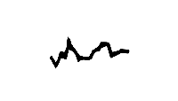 |
| 078 | Trashy Wave 4 (Vague sale 4)                      | Bonne pour effets glitch                                          | 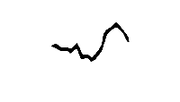 |
| 079 | Trashy Wave 5 (Vague sale 5)                      | Saturée, riche en bruit                                           |  |
| 080 | Trashy Wave 6 (Vague sale 6)                      | Suite de trashs rugueux                                           | 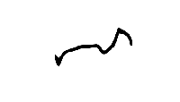 |
| 081 | Jaw Harp 1 (Guimbarde 1)                          | Imite le son métallique d’une guimbarde                           |  |
| 082 | Jaw Harp 2 (Guimbarde 2)                          | Variante plus brillante ou modifiée                               |  |
| 083 | Soft Wave 6 (Vague douce 6)                       | Pad fluide, doux et discret                                       |  |
| 084 | Thin 1 (Mince 1)                                  | Onde fine, utile pour superpositions légères                      | 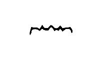 |
| 085 | Thin 2 (Mince 2)                                  | Idéal pour textures discrètes                                     |  |
| 086 | Spark Wave 8 (Vague étincelle 8)                  | Impulsive, métallique                                             |  |
| 087 | Spark Wave 9 (Vague étincelle 9)                  | Percussive, riche en transitoires                                 |  |
| 088 | Spark Wave 10 (Vague étincelle 10)                | Bonne pour rythmes dynamiques                                     |  |
| 089 | Soft Dome 5 (Dôme doux 5)                         | Pad très doux, tubular bells                                      |  |
| 090 | Soft Dome 6 (Dôme doux 6)                         | Encore plus feutré                                                | 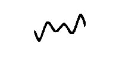 |
| 091 | Cacophonous Buzz 2 (Bourdonnement cacophonique 2) | Buzz dense et aléatoire                                           | 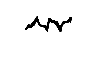 |
| 092 | Thin 3 (Mince 3)                                  | Texture fine et atténuée, suggère une guitare sèche               |  |
| 093 | Spark Wave 11 (Vague étincelle 11)                | Frappante, tranchante                                             |  |
| 094 | Soft Dome 7 (Dôme doux 7)                         | Onde douce, idéale pour ambient lent                              |  |
| 095 | Soft Wave 7 (Vague douce 7)                       | Texture fluide et paisible                                        | 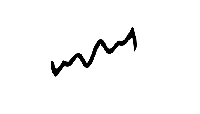 |
| 096 | Sine 2 (Sinusoïdale 2)                            | Variante de sinusoïde, utile pour modulation                      |  |
| 097 | Sync’d Sine (Sinusoïde synchronisée)              | Onde synchronisée, harmonies métalliques                          | 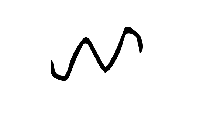 |
| 098 | Trashy Wave 7 (Vague sale 7)                      | Encore plus distordue                                             | 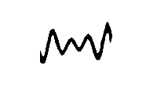 |
| 099 | Twingle Pad (Pad scintillant)                     | Pad riche, scintillant, parfait pour nappes légères               | 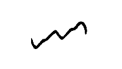 |
| 100 | Dome 9 (Dôme 9)                                   | Version la plus douce, tubular bells                              |  |
| 101 | Thin 4 (Mince 4)                                  | Onde discrète                                                     |  |
| 102 | Thin 5 (Mince 5)                                  | Fine, pour empilements subtils                                    | 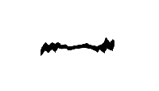 |
| 103 | Trashy Wave 8 (Vague sale 8)                      | Onde sale, rugueuse                                               | 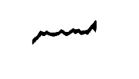 |
| 104 | Trashy Wave 9 (Vague sale 9)                      | Effets industriels, métalique, cordes en acier                    |  |
| 105 | Trashy Wave 10 (Vague sale 10)                    | Bonne pour sons techno                                            |  |
| 106 | Trashy Wave 11 (Vague sale 11)                    | Encore plus rugueuse                                              | 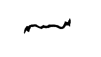 |
| 107 | Trashy Wave 12 (Vague sale 12)                    | Texture destructurée                                              | 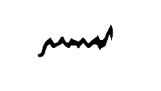 |
| 108 | Trashy Wave 13 (Vague sale 13)                    | Onde destructurée, agressive                                      |  |
| 109 | Spark Wave 12 (Vague étincelle 12)                | Impulsive, effet FX                                               | 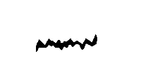 |
| 110 | Spark Wave 13 (Vague étincelle 13)                | Transitoires métalliques                                          | 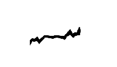 |
| 111 | Trashy Wave 14 (Vague sale 14)                    | Extrêmement rugueuse                                              |  |
| 112 | Trashy Wave 15 (Vague sale 15)                    | Variante saturée finale, handpan, pan, steelpan, steeldrum        | 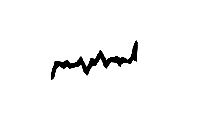 |
| 113 | Rainbow (Arc-en-ciel)                             | Onde riche et colorée, idéale pour pads                           |  |
| 114 | Soft Dome 8 (Dôme doux 8)                         | Pad doux, fluide et large                                         |  |
| 115 | Trashy Wave 16 (Vague sale 16)                    | Variante finale, handpan saturé                                   | 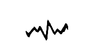 |
| 116 | Soothing 1 (Apaisant 1)                           | Texture calmante, ambient lent                                    | 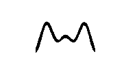 |
| 117 | Soothing 2 (Apaisant 2)                           | Encore plus douce                                                 | 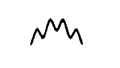 |
| 118 | Space Wave (Vague spatiale)                       | Onde cosmique, idéale pour fond stéréo                            |  |
| 119 | 5th Rasp (5e râpe)                                | Onde râpeuse en intervalles de quinte                             |  |
| 120 | Octave Wave (Vague octave)                        | Superposition d’octaves, idéale pour épaisseur sonore             |  |
| 121 | Triangle + Overtones (Triangle + harmoniques)     | Triangle enrichi, utile pour FM ou textures subtiles              |  |
| 122 | Pulse + Overtones (Impulsion + harmoniques)       | Pulse enrichi pour leads puissants                                |  |
| 123 | Rising Square (Carrée montante)                   | Onde carrée dynamique, montée énergétique                         |  |
| 124 | Soft Wave 8 (Vague douce 8)                       | Timbre fluide, nappes légères                                     |  |
| 125 | Cacophonous Buzz 3 (Bourdonnement cacophonique 3) | Buzz intense, bruit FM/industriel, cloche                         |  |
| 126 | Silence (Silence)                                 | Aucune onde — utile pour muting ou slot vide                      |  |
| 127 | White Noise (Bruit blanc)                         | Onde bruitée, utile pour percussions ou FX                        |  |

[Retour à la page principale](https://github.com/ppyne/BehringerProVSMini)
